# cheese-quizz-gke


A fun cheese quizz deployed on GKE and illustrating cloud native technologies like Quarkus, Anthos Service Mesh, Cloud Code, Cloud Build, Cloud Function, Google PubSub, Apigee Integration and ....

> This is a port to Google platform of this original [cheese-quizz](https://github.com/lbroudoux/cheese-quizz). This is a *Work In Progress*.

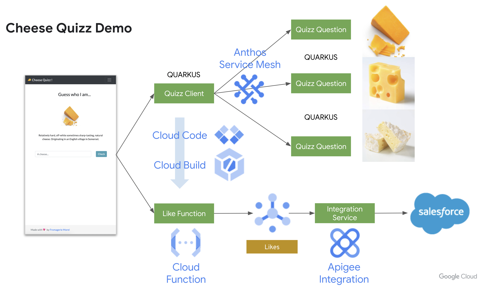

* **Part 1** Try to guess the displayed cheese! Introducing new cheese questions with Canaray Release and making everything resilient and observable using Istio Service Mesh. Deploy supersonic components made in Quarkus,

* **Part 2** Implement a new "Like Cheese" feature in a breeze using Google Cloud Code, demonstrate the inner loop development experience and then deploy everything using Cloud Build.

* **Part 3** Add the "Like Cheese API" using Serverless Cloud Function and make it push new messages to PubSub broker. Use Apigee Integration IPaaS to deploy new integration services and create lead into Salesforce CRM 😉


## Project Setup

As this demonstration quizz uses a lot of Google Cloud Platform APIs, we recommend creating an isolated project. We called it `cheese-quizz` in our case. Maybe we've have forgotten some placeholders in commands 😉

Enable the required APIs using this command once logger into your project:

```sh
gcloud services enable compute.googleapis.com \
    servicenetworking.googleapis.com \
    container.googleapis.com \
    artifactregistry.googleapis.com \
    anthos.googleapis.com \
    mesh.googleapis.com \
    meshconfig.googleapis.com \
    cloudbuild.googleapis.com \
    run.googleapis.com \
    cloudfunctions.googleapis.com \
    pubsub.googleapis.com \
    apigee.googleapis.com \
    integrations.googleapis.com \
    connectors.googleapis.com \
    cloudkms.googleapis.com \
    secretmanager.googleapis.com
```

## Cluster Setup

Create a Google Kubernetes Engine cluster called `cluster-1`. You can choose either a public cluster or a private one with a public endpoint (however this later option will make things trickier when setting up CI/CD with Cloud Build 🤪). I've used `e2-medium` nodes with auto-scaling of node pool enabled.

Also, check that the following properties must be enabled:
* HTTP load balancing in *Networking* settings,
* Workload Identity in *Security* settings, 
* Anthos Service Mesh in *Features* settings.

Once your cluster is ready, check Workload Identitty:

```sh
$ gcloud container clusters describe cluster-1 --format="value(workloadIdentityConfig.workloadPool)" --region europe-west9
```

If result is `cheese-quizz.svc.id.goog` then it's enabled.

Also, check that your cluster has been automatically enrolled to an Anthos fleet and get information on this fleet and membership. You'll see that memebership is `READY` and that the control plane management for the mesh is `DISABLED`:

> Reference: https://cloud.google.com/service-mesh/docs/managed/auto-control-plane-with-fleet

```sh
$ gcloud container fleet memberships list 
NAME       EXTERNAL_ID
cluster-1  b43cd750-de46-4e43-b98e-2834aa1e4ad4
```

```sh
$ gcloud container fleet memberships describe cluster-1
authority:
  identityProvider: https://container.googleapis.com/v1/projects/cheese-quizz/locations/europe-west9/clusters/cluster-1
  issuer: https://container.googleapis.com/v1/projects/cheese-quizz/locations/europe-west9/clusters/cluster-1
  workloadIdentityPool: cheese-quizz.svc.id.goog
createTime: '2022-08-09T16:39:21.930439260Z'
description: cluster-1
endpoint:
  gkeCluster:
    resourceLink: //container.googleapis.com/projects/cheese-quizz/locations/europe-west9/clusters/cluster-1
  kubernetesMetadata:
    kubernetesApiServerVersion: v1.22.10-gke.600
    memoryMb: 12369
    nodeCount: 3
    nodeProviderId: gce
    updateTime: '2022-08-09T17:05:08.118548452Z'
    vcpuCount: 6
externalId: b43cd750-de46-4e43-b98e-2834aa1e4ad4
name: projects/cheese-quizz/locations/global/memberships/cluster-1
state:
  code: READY
uniqueId: 295d5c06-65ce-44dd-8922-8626b7fe6af5
updateTime: '2022-08-09T17:05:08.263985853Z'
```

```sh
$ gcloud container fleet mesh describe --project cheese-quizz
createTime: '2022-06-27T16:48:51.055892224Z'
membershipStates:
  projects/966285747060/locations/global/memberships/cluster-1:
    servicemesh:
      controlPlaneManagement:
        state: DISABLED
    state:
      code: OK
      description: Please see https://cloud.google.com/service-mesh/docs/install for
        instructions to onboard to Anthos Service Mesh.
      updateTime: '2022-08-09T17:06:37.217361639Z'
name: projects/cheese-quizz/locations/global/features/servicemesh
resourceState:
  state: ACTIVE
spec: {}
updateTime: '2022-08-09T17:06:40.106900964Z'
```

Enable the automatic control plane management for our service mesh on `cluster-1`:

```sh
gcloud container fleet mesh update \
     --control-plane automatic \
     --memberships cluster-1 \
     --project cheese-quizz
```

Check we have actually switched to `AUTOMATIC`:

```sh
$ gcloud container fleet mesh describe --project cheese-quizz
createTime: '2022-06-27T16:48:51.055892224Z'
membershipSpecs:
  projects/966285747060/locations/global/memberships/cluster-1:
    mesh:
      controlPlane: AUTOMATIC
membershipStates:
  projects/966285747060/locations/global/memberships/cluster-1:
    servicemesh:
      controlPlaneManagement: {}
    state:
      code: OK
      description: Please see https://cloud.google.com/service-mesh/docs/install for
        instructions to onboard to Anthos Service Mesh.
      updateTime: '2022-08-09T17:09:08.560029461Z'
name: projects/cheese-quizz/locations/global/features/servicemesh
resourceState:
  state: ACTIVE
spec: {}
state:
  state: {}
updateTime: '2022-08-09T17:09:09.793769752Z'
```

And after some time that we now have an `istio-system` namespace with an `asm-managed` control plane revision: 

```sh
$ kubectl -n istio-system get controlplanerevision
NAME          RECONCILED   STALLED   AGE
asm-managed   True         False     4m15s
```

Finally, turn on the sidecar proxy injection into the `cheese-quizz` namespace of our cluster.

> Reference: https://cloud.google.com/service-mesh/docs/anthos-service-mesh-proxy-injection

```sh
$ kubectl create namespace cheese-quizz
$ kubectl label namespace cheese-quizz istio-injection- istio.io/rev=asm-managed --overwrite
label "istio-injection" not found.
namespace/cheese-quizz labeled
```

Enable Tracing as specified in https://cloud.google.com/service-mesh/docs/managed/enable-managed-anthos-service-mesh-optional-features#enable_cloud_tracing.
Raise the `sampling` rate so that we'll be able to see changes faster. Here's the extract of `istio-asm-managed` config map in `istio-system` namespace:

```yaml
data:
  mesh: |-
    defaultConfig:
      tracing:
        sampling: 50
        stackdriver: {}
```

## Demo setup

We need to setup the following resources for our demonstration:

* A `cheese-quizz` namespace for holding your project components

```sh
kubectl apply -f manifests/quizz-question-deployment-v1.yml -n cheese-quizz
kubectl apply -f manifests/quizz-question-deployment-v2.yml -n cheese-quizz
kubectl apply -f manifests/quizz-question-deployment-v3.yml -n cheese-quizz
kubectl apply -f manifests/quizz-question-service.yml -n cheese-quizz
kubectl apply -f manifests/quizz-question-destinationrule.yml -n cheese-quizz
kubectl apply -f manifests/quizz-question-virtualservice-v1.yml -n cheese-quizz
```

Then we need to create a Cloud Build build that will be in charge of building the client component and store it into Artifact Registry:

```sh
export PROJECT=cheese-quizz
export PROJECT_NUMBER=$(gcloud projects describe $PROJECT --format 'value(projectNumber)') 

gcloud artifacts repositories create container-registry \
    --repository-format=docker \
    --location=europe

gcloud projects add-iam-policy-binding $PROJECT \
    --member=serviceAccount:${PROJECT_NUMBER}-compute@developer.gserviceaccount.com \
    --role=roles/artifactregistry.reader
    
gcloud builds submit --config quizz-client/cloudbuild.yaml quizz-client/
```

```sh
kubectl apply -f manifests/quizz-client-deployment.yml -n cheese-quizz
kubectl apply -f manifests/quizz-client-service.yml -n cheese-quizz
```

In order to expose our application to the outer world, we'll need to reserve an IP address before creating and Ingres and probably set up a DNS entry for the host name you'll use instead of mine:

```sh
export CHEESE_QUIZZ_URL=my-cheese-quizz.acme.com

gcloud compute addresses create cheese-quizz-gke-adr --global

sed -i '' 's=cheese-quizz-client.cheese-quizz.lbroudoux.demo.altostrat.com='"$CHEESE_QUIZZ_URL"'=g' manifests/quizz-client-ingress.yml
kubectl apply -f manifests/quizz-client-ingress.yml -n cheese-quizz
```

## Demonstration scenario

Once above commands are issued and everything successfully deployed, retrieve the Cheese Quizz ingress:

```sh
kubectl get ingress/cheese-quizz-client-ingress -n cheese-quizz | grep cheese-quizz-client | awk '{print $3}'
```

and open it into a browser. You should get the following:


### Anthos Service Mesh demonstration

This is the beginning of **Part 1** of the demonstration. We're going to deep dive in most of the features and benefits that are brought by a Service Mesh.

#### Canary release and blue-green deployment

Introduce new `v2` question using Canary Release and header-matching routing rules:

```
kubectl apply -f istiofiles/vs-cheese-quizz-question-v1-v2-canary.yml -n cheese-quizz
```

Using the hamburger menu on the GUI, you should be able to subscribe the `Beta Program` and see the new Emmental question appear ;-) 


Now turning on the `Auto Refresh` feature, you should be able to visualize everything into Anthos console, showing how turning on and off the Beta subscription has influence on the visualization of networks routes.

Once we're confident with the `v2` Emmental question, we can turn on Blue-Green deployment process using weighted routes on the Istio `VirtualService`. We apply a 70-30 repartition:

```
kubectl apply -f istiofiles/vs-cheese-quizz-question-v1-70-v2-30.yml -n cheese-quizz
```

Of course we can repeat the same kind of process and finally introduce our `v3` Camembert question into the game. Finally, we may choose to route evenly to all the different quizz questions, applying a even load-balancer rules on the `VirtualService`: 

```
kubectl apply -f istiofiles/vs-cheese-quizz-question-all.yml -n cheese-quizz
```

#### Circuit breaker and observability

Now let's check some network resiliency features of OpenShift Service Mesh.

Start by simulating some issues on the `v2` deployed Pod. For that, we can remote log to shell and invoke an embedded endpoint that will make the pod fail. Here is bellow the sequence of commands you'll need to adapt and run:

```sh
$ kubectl get pods -n cheese-quizz | grep v2
cheese-quizz-question-v2-5c96c7dc46-bmw2q   2/2     Running   0          14m0          5d19h

$ kubectl exec -it cheese-quizz-question-v2-5c96c7dc46-bmw2q -n cheese-quizz -- /bin/bash
----------- TERMINAL MODE: --------------------
[root@cheese-quizz-question-v2-5c96c7dc46-bmw2q work]# curl localhost:8080/api/cheese/flag/misbehave
Following requests to / will return a 503
[root@cheese-quizz-question-v2-5c96c7dc46-bmw2q work]# exit
exit
```

Back to the browser window you should now have a little mouse displayed when application tries to reach the `v2` question of the quizz.


Using obervability features that comes with Anthos Service Mesh like Traffic Monitoring and Tracing, you are now able to troubleshoot and check where the problem comes from (imagine that we already forgot we did introduce the error ;-))

Thus you can see the Pod causing troubles with traffic monitoring graph:


> You may notice that traffic is not evenly dsitributed among the 3 versions since we introduce therror. You'll understand that in a minute.

And inspect traces that are available from the Service Metrics pane to see errors. Be sure to add a `LABEL:error : true` or a `HashLabel : error` criterion to the search bar:


In order to make our application more resilient, we have to start by creating new replicas, so scale the `v2` deployment.

```
kubectl scale deployment/cheese-quizz-question-v2 --replicas=2 -n cheese-quizz
```

Newly created pod will serve requests without error but we can see in the Anthos console that the service `cheese-quizz-question` remains degraded (despite green arrows joinining `v2` Pods).


There's still some errors in distributed traces. You can inspect what's going on using Traces and may check that there's still some invocations going to the faulty `v2` pod.

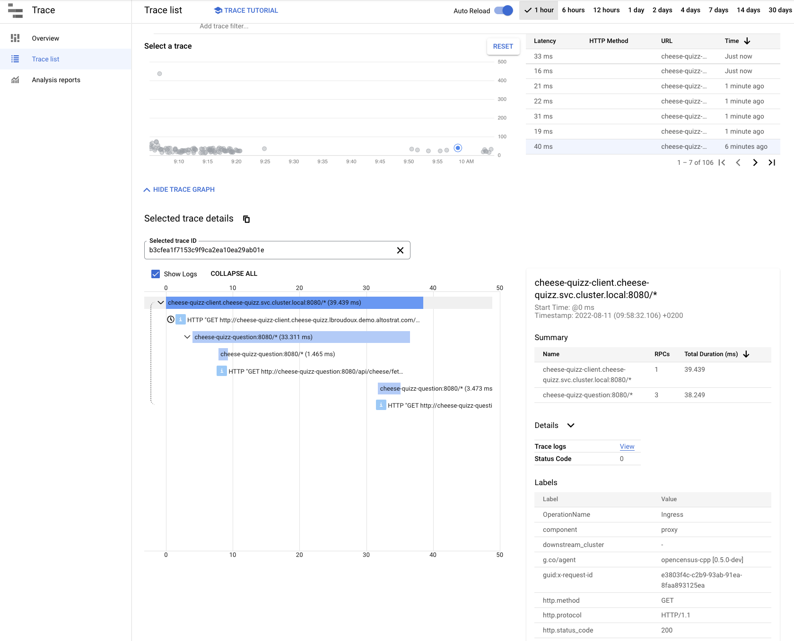

Istio proxies automatically retry doing the invocation to `v2` because a number of conditions are present:
* There's a second replica present,
* It's a HTTP `GET` request that is supposed to be idempotent (so replay is safe).

An optimal way of managing this kind of issue would be to declare a `CircuitBreaker` for handling this problem more efficiently. Circuit breaker policy will be in charge to detect Pod returning errors and evict them from the elligible targets pool for a configured time. Then, the endpoint will be re-tried and will re-join the pool if everything is back to normal.

Let's apply the circuit breaker configuration to our question `DestinationRule`:

```
kubectl apply -f istiofiles/dr-cheese-quizz-question-cb.yml -n cheese-quizz
```

Checking the traces once again in Tracing, you should no longer see any errors! 

#### Timeout/retries management

Pursuing with network resiliency features of OpenShift Service Mesh, let's check now how to handle timeouts.

Start by simulating some latencies on the `v3` deployed Pod. For that, we can remote log to shell and invoke an embedded endpoint that will make the pod slow. Here is bellow the sequence of commands you'll need to adapt and run:

````sh
$ kubectl get pods -n cheese-quizz | grep v3
cheese-quizz-question-v3-8c5448d46-6nn7c    2/2     Running   0          147m

$ kubectl exec -it cheese-quizz-question-v3-8c5448d46-6nn7c -n cheese-quizz -- /bin/bash
----------- TERMINAL MODE: --------------------
[root@cheese-quizz-question-v3-8c5448d46-6nn7c work]# curl localhost:8080/api/cheese/flag/timeout
Following requests to / will wait 3s
[root@cheese-quizz-question-v3-8c5448d46-6nn7c work]# exit
exit
````

Back to the browser window you should now have some moistures displayed when application tries to reach the `v3` question of the quizz.


Before digging and solving this issue, let's review the application configuration :
* A 3 seconds timeout is configured within the Pod handling the `v3` question. Let see the [question source code](https://github.com/lbroudoux/cheese-quizz/blob/master/quizz-question/src/main/java/com/github/lbroudoux/cheese/CheeseResource.java#L110)
* A 1.5 seconds timeout is configured within the Pod handling the client. Let see the [client configuration](https://github.com/lbroudoux/cheese-quizz/blob/master/quizz-client/src/main/resources/application.properties#L14)

Checking the distributed traces within Anthos console we can actually see that the request takes 1.5 seconds before returning an error:

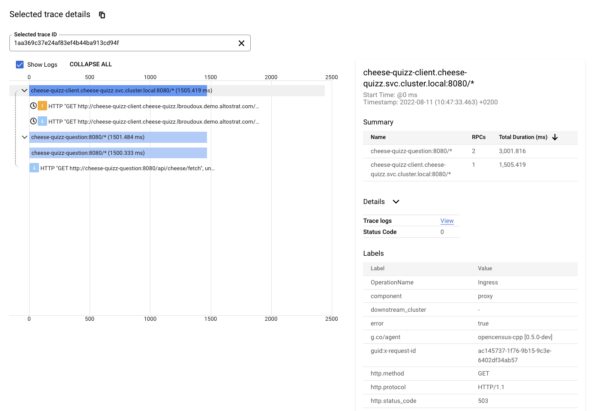

In order to make our application more resilient, we have to start by creating new replicas, so scale the `v3` deployment.

```
kubectl scale deployment/cheese-quizz-question-v3 --replicas=2 -n cheese-quizz
```

Newly created pod will serve requests without timeout but we can see in the Traffic console that the service `cheese-quizz-question` remains degraded (see increased latency on `v3` Pods).


However there's still some errors in distributed traces. You can inspect what's going on using Tracing and may check that there's still some invocations going to the slow `v3` pod.

The `CircuitBreaker` policy applied previsouly does not do anything here because the issue is not an application problem that can be detected by Istio proxy. The result of a timed out invocation remains uncertain, but we know that in our case - an idempotent `GET` HTTP request - we can retry the invocation.

Let's apply for this a new `VirtualService` policy that will involve a retry on timeout.

```
kubectl apply -f istiofiles/vs-cheese-quizz-question-all-retry-timeout.yml -n cheese-quizz
```

Once applied, you should not see errors on the GUI anymore. When digging deep dive into the distributed traces offered by OpenShift Service Mesh, you may however see errors traces. Getting into the details, you see that detailed parameters of the `VirtualService` are applied: Istio do not wait longer than 100 ms before making another attempt and finally reaching a valid endpoint.


The Service Mesh traffic graph allows to check that - from a end user point of view - the service is available and green. We can see that time-to-time the HTTP throughput on `v3` may be reduced due to some failing attempts but we have now great SLA even if we've got one `v2` Pod failing and one `v3` Pod having response time issues:


#### Direct access through a Gateway

So far we always used the classical way of entering the application through `cheese-quizz-client` pods only. It's now time to see how to use a `Gateway`. Gateway configurations are applied to standalone Envoy proxies that are running at the edge of the mesh, rather than sidecar Envoy proxies running alongside your service workloads.

Before creating `Gateway` and updating the `VirtualService` to be reached by the gateway, you will needs to adapt the full host name in both resources below. Then apply them:

> WIP to be finalized.

```sh
kubectl apply -f istiofiles/ga-cheese-quizz-question.yml -n cheese-quizz
kubectl apply -f istiofiles/vs-cheese-quizz-question-all-gateway.yml -n cheese-quizz
```

### Cloud Code demonstration

This is the beginning of **Part 2** of the demonstration. Start modifying our application by opening the code in Cloud Shell Editor with below button:

<a target="__blank" href="https://shell.cloud.google.com?git_repo=https://github.com/lbroudoux/cheese-quizz&page=editor"></a>

> If it's the first time, you're connecting the service, you'll need to authenticate and approve the reuse of your profile information.

After some minutes, the workspace is initialized with the source files coming from a Git clone. You can spend time exploring the content of the wokspace.


Now let's build and deploy some components in order to illustrate the development inner loop.

Launch a new ternminal (`Terminal > New Terminal`), navigate to the `quizz-model` component and install it using the `mvn install` command. Here's rge terminal results below:


Then, you will be able to launch the `quizz-question` module in Quarkus development mode through terminal. Navigate to correct module and issue the `mvn quarlus:dev` command.


Finally, you can launch the `quizz-client` module using a new terminal window this time. Navigate to correct module and issue the `mvn quarkus:dev` command as shown below. 


Now you will have access to the GUI, running in Cloud Shell Editor, by launching the preview and configuring it on port `8081`:

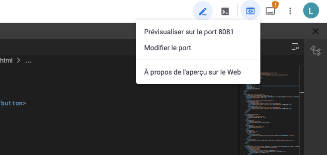

It's time to talk a little bit about Quarkus, demo hot reloading and explain how we're gonna implement the "Like Cheese" screen by modifying `src/main/resources/META-INF/index.html` and test it locally:


Before commiting our work, we'd like to talk a bit about how to transition to the outer-loop and trigger deployment pipeline.

### Cloud Build Pipelines demonstration

We're now going to setup a Cloud Build pipeline that will triggered by a GitHub commit, build a new container image containing changes and autoimatically deploy it to our GKE cluster.

Depending on your cluster setting, you may need some tricky setup! Actually when using a private cluster mode with public endpoint, your Cloud Build build will need to present an IP address that is part of declared CIDR for accessing the cluster. So you'll need to setup what is called a *Cloud Build private pool* that will be peered to one VPC on your project so that egress access to the internet can be easily managed.

<details>
  <summary>Private cluster with public endpoint setup extra steps</summary>

  > Reference: https://cloud.google.com/architecture/accessing-private-gke-clusters-with-cloud-build-private-pools#creating_a_private_pool

  ```sh
  export PROJECT_NUMBER=$(gcloud projects describe cheese-quizz --format 'value(projectNumber)') 

  # Must create a dedicated vpc to be peered with Cloud Build private pool.
  gcloud compute networks create cloud-build-pool-vpc --subnet-mode=CUSTOM

  # With only one subnet on our region.
  gcloud compute networks subnets create cloud-build-pool-network \
    --range=10.124.0.0/20 --network=default --region=europe-west9

  # Now create a router to control how we access internet from this vpc
  gcloud compute routers create cloud-build-router \
    --network=cloud-build-pool-vpc \
    --region=europe-west9

  # Reserve a static IP address for egress. This IP must be added in authorized CIDR for the GKE cluster API access.
  gcloud compute addresses create cloud-build-egress-ip --region=europe-west9

  # Configure NAT Gateway to use this egress IP.
  gcloud compute routers nats create cloud-router-nat-gateway \
    --router=cloud-build-router \
    --region=europe-west9 \
    --nat-custom-subnet-ip-ranges=cloud-build-pool-network  \
    --nat-external-ip-pool=cloud-build-egress-ip

  # Now create a simple VM to act as a proxy/nat for outgoing traffic.
  gcloud compute instances create cloud-build-proxy-nat --zone=europe-west9-b \
    --machine-type=n1-standard-1 --image-project=ubuntu-os-cloud --image-family=ubuntu-1804-lts \
    --network=cloud-build-pool-vpc --subnet=cloud-build-pool-subnet --private-network-ip 10.124.0.5 --no-address \
    --tags allowlisted-access --can-ip-forward \
    --metadata=startup-script=$'sysctl -w net.ipv4.ip_forward=1 && iptables -t nat -A POSTROUTING -o $(/sbin/ifconfig | head -1 | awk -F: {\'print $1\'}) -j MASQUERADE'

  # Reconfigure access to internet forcing non tagged traffic to go to the VM first.
  gcloud compute routes create nat-route-to-internet \
    --destination-range=0.0.0.0/1 --next-hop-address=10.124.0.5 --network=cloud-build-pool-vpc 

  gcloud compute routes create nat-route-to-internet-2 \
    --destination-range=128.0.0.0/1 --next-hop-address=10.124.0.5 --network=cloud-build-pool-vpc 

  gcloud compute routes create nat-route-to-internet-tagged \
    --destination-range=0.0.0.0/1 --next-hop-gateway=default-internet-gateway --network=cloud-build-pool-vpc \
    --priority 10 --tags allowlisted-access

  gcloud compute routes create nat-route-to-internet-tagged-2 \
    --destination-range=128.0.0.0/1 --next-hop-gateway=default-internet-gateway --network=cloud-build-pool-vpc \
    --priority 10 --tags allowlisted-access

  # In the VPC network, allocate a named IP range for vpc peeering.
  gcloud compute addresses create cloud-build-pool-range \
      --global \
      --purpose=VPC_PEERING \
      --addresses=192.168.0.0 \
      --prefix-length=20 \
      --network=cloud-build-pool-vpc \
      --project=cheese-quizz

  # Create a private connection between the service producer network and your VPC network
  gcloud services vpc-peerings connect \
      --service=servicenetworking.googleapis.com \
      --ranges=cloud-build-pool-range \
      --network=cloud-build-pool-vpc \
      --project=cheese-quizz

  # Custom routes to the internet (through the VM) should be exported on the peered managed VPC.
  gcloud compute networks peerings update servicenetworking-googleapis-com \
      --network=cloud-build-pool-vpc \
      --export-custom-routes \
      --no-export-subnet-routes-with-public-ip

  # Create the Cloud Build worker pool that is peered to default network
  gcloud builds worker-pools create my-pool \
      --project=cheese-quizz \
      --region=europe-west9 \
      --peered-network=projects/cheese-quizz/global/networks/cloud-build-pool-vpc \
      --worker-machine-type=e2-standard-2 \
      --worker-disk-size=100GB
  ```
</details>

Connect your preferred Git repostiory to Cloud Build following [the documentation](https://cloud.google.com/build/docs/triggers). Here's an example of the connection done using this GitHub repository:


Then, configure a `build` trigger on your Git repository holding the sources.

> If you're using a private cluster with public endpoint, replace the `cloudbuild-pipeline.yaml` with `cloudbuild-pipeline-pool.yaml` to force reuse the Cloud Build private pool.

```sh
# Now create the build trigger (finally!)
gcloud beta builds triggers create github \
    --name=quizz-client-trigger \
    --repo-name=cheese-quizz-gke \
    --repo-owner=lbroudoux \
    --branch-pattern=main \
    --included-files=quizz-client/** \
    --build-config=quizz-client/cloudbuild-pipeline.yaml
```

Now that this part is OK, you can finish your work into CodeReady Workspaces by commiting the changed file and pushing to your remote repository:

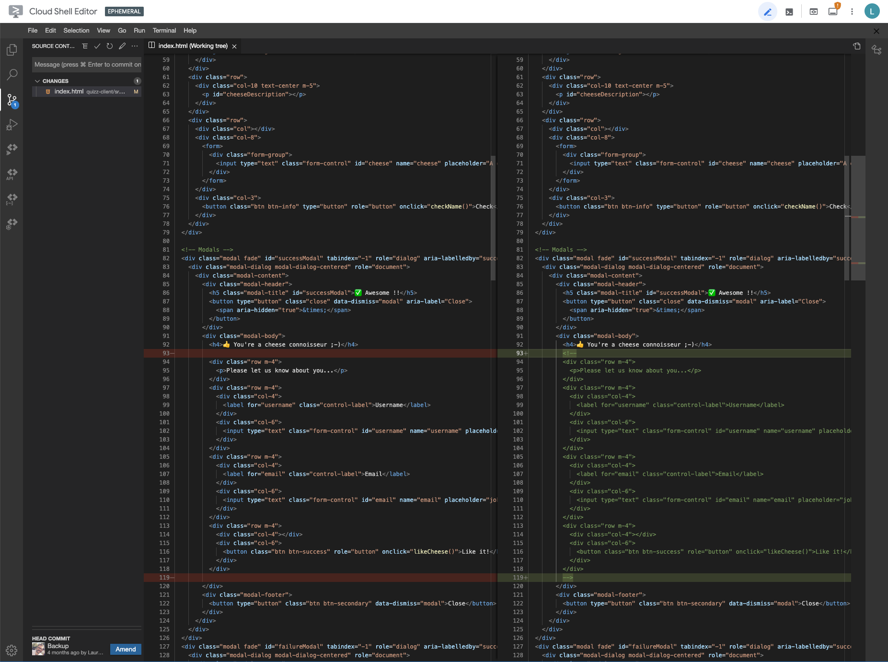

And this should simply trigger the Cloud Build pipeline we just created! You can display the different task logs in Cloud Build console:

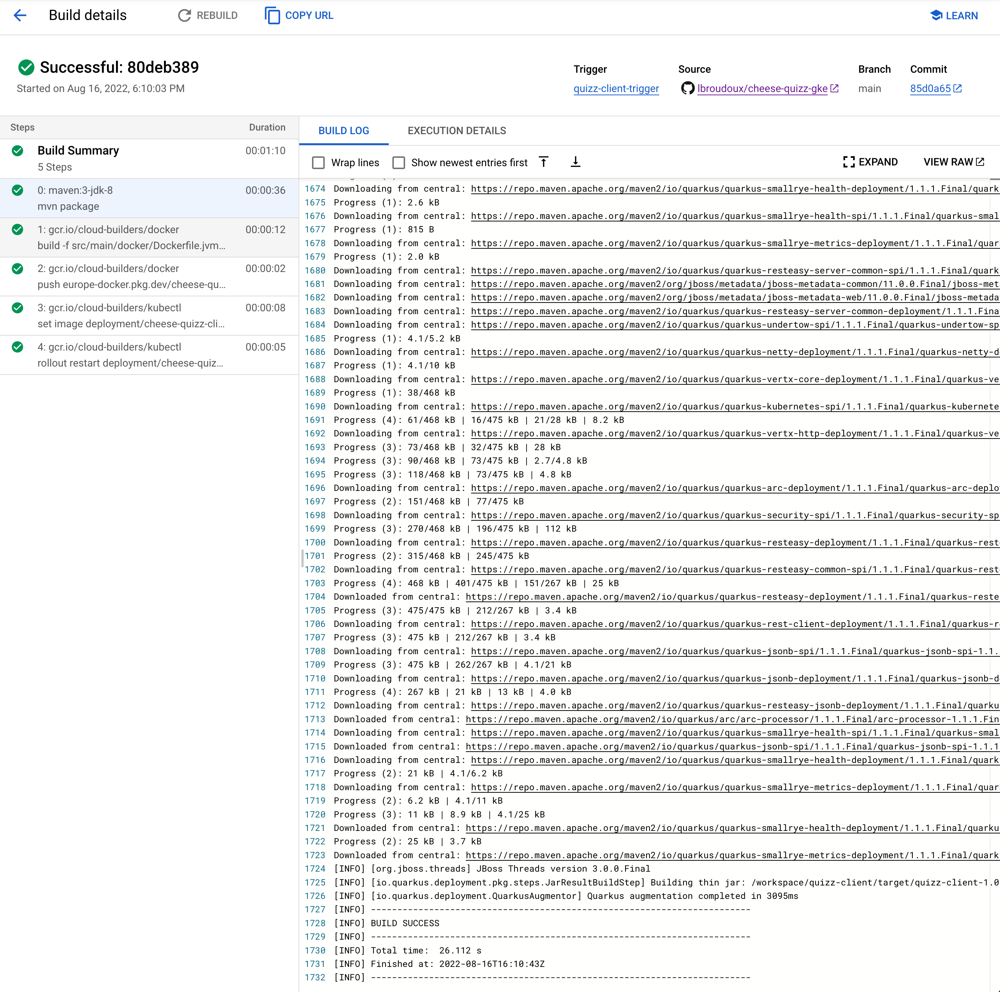

And finally ensure that our pipeline is successful.

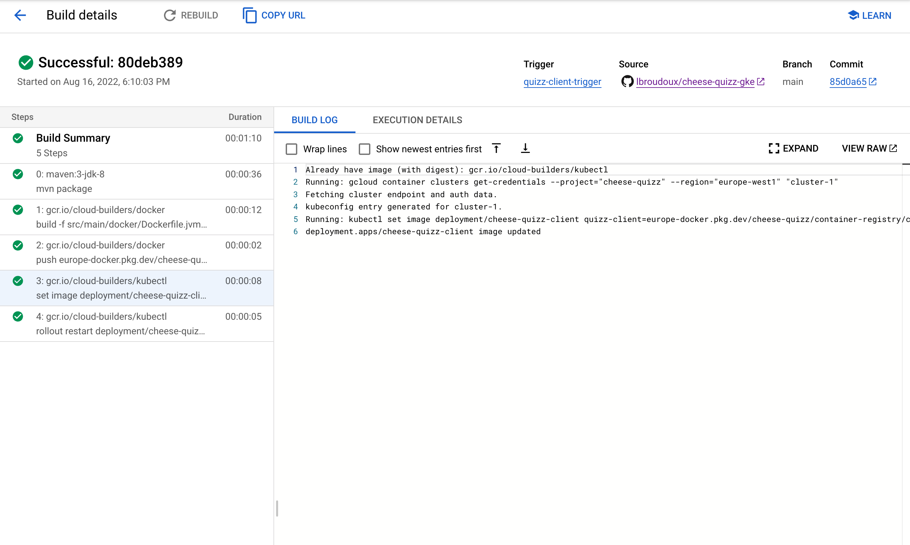

### Google Cloud Serverless demonstration

This is the beginning of **Part 3** of the demonstration. Now you're gonne link the "Like Cheese" feature with a message publication within a PubSub broker. So first, we have to configure a PubSub topic we'll use to advert of new `CheeseLike` messages:

```sh
gcloud pubsub topics create cheese-quizz-likes
gcloud pubsub subscriptions create cheese-quizz-likes-echo --message-retention-duration=10m --topic cheese-quizz-likes
```

> We created a `echo` subscription for tracking and troubleshooting published messages.

We're gonna create a dedicated service account for our serverless function and make this account a PubSub publisher:

```sh
export PROJECT=cheese-quizz

gcloud iam service-accounts create cheese-like-function-sa \
    --description="Service account for cheese-like-function"

gcloud projects add-iam-policy-binding $PROJECT \
    --member=serviceAccount:cheese-like-function-sa@$PROJECT.iam.gserviceaccount.com\
    --role=roles/pubsub.publisher --condition=None
```

Now just deploy our `quizz-like-function` module that is a NodeJS app as a new `cheese-quizz-like-function` Cloud Function. Here's the command line that should be issued from the root of this repository (it reuses the services account we created and authorized on PubSub topic):

```sh
gcloud functions deploy cheese-quizz-like-function \
    --gen2 --region=europe-west9 \
    --runtime=nodejs20 \
    --source=quizz-like-function-cf \
    --entry-point=apiLike \
    --trigger-http --allow-unauthenticated \
    --service-account cheese-like-function-sa@cheese-quizz.iam.gserviceaccount.com \
    --set-env-vars=PUBSUBPROJECT_HOST=$PROJECT
```

Looking at the Cloud Functions console, we can grasp details on our function revisions, metrics and associated HTTP trigger/endpoint.

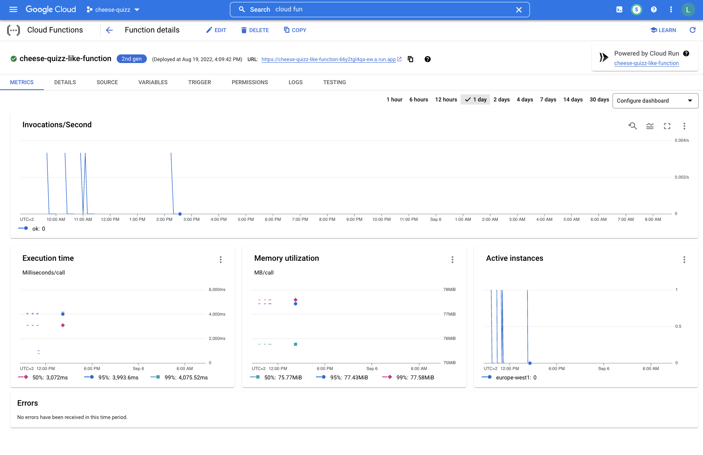

Now just demo how Pod are dynamically popped and drained when invocation occurs on function route. You may just click on the access link on the Developer Console or retrieve exposed URL from the command line:

```sh
$ gcloud functions describe cheese-quizz-like-function --region=europe-west9 --gen2 | yq '.serviceConfig.uri'
https://cheese-quizz-like-function-66y2tgl4qa-ew.a.run.app

# Test things out with a simple post message
$ curl -XPOST https://cheese-quizz-like-function-66y2tgl4qa-ew.a.run.app -k -H 'Content-type: application/json' -d '{"greeting":"hello4"}'
```

Now that we also have this URL, we should update the `cheese-quizz-client-config` ConfigMap that should hold this value and serve it to our GUI.

```sh
$ kubectl edit cm/cheese-quizz-client-config -n cheese-quizz
----------- TERMINAL MODE: --------------------
# Please edit the object below. Lines beginning with a '#' will be ignored,
# and an empty file will abort the edit. If an error occurs while saving this file will be
# reopened with the relevant failures.
#
apiVersion: v1
data:
  application.properties: |-
    # Configuration file
    # key = value
    %kube.quizz-like-function.url=https://cheese-quizz-like-function-66y2tgl4qa-ew.a.run.app
kind: ConfigMap
metadata:
  annotations:
    kubectl.kubernetes.io/last-applied-configuration: |
      {"apiVersion":"v1","data":{"application.properties":"# Configuration file\n# key = value\n%kube.quizz-like-function.url=http://cheese-quizz-like-function.cheese-quizz.lbroudoux.demo.altostrat.com"},"kind":"ConfigMap","metadata":{"annotations":{},"name":"cheese-quizz-client-config","namespace":"cheese-quizz"}}
  creationTimestamp: "2022-08-10T10:05:53Z"
  name: cheese-quizz-client-config
  namespace: cheese-quizz
  resourceVersion: "28136832"
  uid: d42d397b-bb0c-472b-93c1-98d4bfd90f75
~                                                                             
~                                                                           
~                                                                             
-- INSERT --
:wq
configmap/cheese-quizz-client-config edited
```

> Do not forget to delete the remaining `cheese-quizz-client` pod to ensure reloading of changed ConfigMap.

### Apigee Integration demonstration

This is the final part where you'll reuse the events produced by your function within PubSub broker in order to turn into business insights!

First thing first, provision an Apigee organization attached to your GCP project. This could be an evaluation roganization or a full blown one. This can be simply done using that [guide](https://cloud.google.com/apigee/docs/api-platform/integration/getting-started-apigee-integration). If provisionning through th wizrd fails or if you want a more automated way, check the notes below.

<details>
  <summary>Provisionning Apigee eval org with command line</summary>

  ```sh
  gcloud compute addresses create google-managed-services-default \
    --global \
    --prefix-length=22 \
    --description="Peering range for Google Managed services" \
    --network=default \
    --purpose=VPC_PEERING \
    --project=cheese-quizz

  gcloud compute addresses create google-managed-services-support-1 \
    --global \
    --prefix-length=28 \
    --description="Peering range for supporting Apigee services" \
    --network=default \
    --purpose=VPC_PEERING \
    --project=cheese-quizz

  gcloud services vpc-peerings connect \
    --service=servicenetworking.googleapis.com \
    --network=default \
    --ranges=google-managed-services-default \
    --project=cheese-quizz

  # If previous command is not ok, try update with force ;-)
  gcloud services vpc-peerings update \
    --service=servicenetworking.googleapis.com \
    --network=default \
    --ranges=google-managed-services-default \
    --project=cheese-quizz

  # Or replace with with double peering to enabled 
  gcloud services vpc-peerings connect \
    --service=servicenetworking.googleapis.com \
    --network=default \
    --ranges=google-managed-services-default,google-managed-services-support-1 \
    --project=cheese-quizz

  gcloud alpha apigee organizations provision \
    --runtime-location=europe-west9 \
    --analytics-region=europe-west9 \
    --authorized-network=default \
    --project=cheese-quizz
  ```
</details>

Then, the next step is to setup a Salesforce Connector. Here again, have a look at the [https://cloud.google.com/apigee/docs/api-platform/connectors/configure-salesforce](guide).

<details>
  <summary>My settings for Salesforce authentication and permissions</summary>

  ```sh
  $ openssl req -x509 -sha256 -nodes -days 36500 -newkey rsa:2048 -keyout salesforce.key -out salesforce.crt
  Generating a 2048 bit RSA private key
  ..............................................................+++
  .................................+++
  writing new private key to 'salesforce.key'
  -----
  You are about to be asked to enter information that will be incorporated
  into your certificate request.
  What you are about to enter is what is called a Distinguished Name or a DN.
  There are quite a few fields but you can leave some blank
  For some fields there will be a default value,
  If you enter '.', the field will be left blank.
  -----
  Country Name (2 letter code) []:FR
  State or Province Name (full name) []:Sarthe
  Locality Name (eg, city) []:Le Mans
  Organization Name (eg, company) []:lbroudoux
  Organizational Unit Name (eg, section) []:Home
  Common Name (eg, fully qualified host name) []:localhost
  Email Address []:laurent.broudoux@gmail.com
  ```

  While creating your connected app on the Salesforce side, be sure to put the necessary permissions so that we'll be able to create *Leads* from the Apigee integration. Start by creating a custom `PermissionSet`, named for example `Cheese Quizz App` like below capture:

  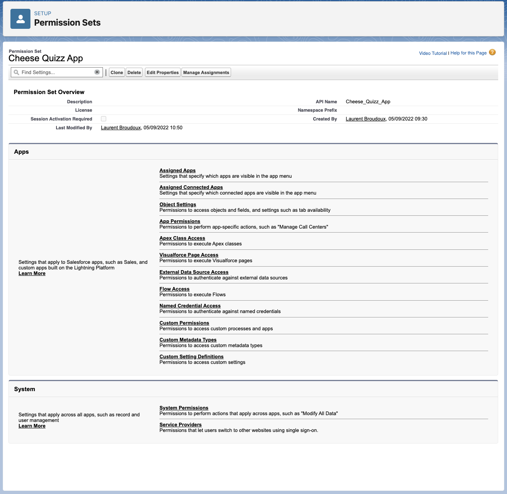

  In this permission set, edit the `Object Settings` so that you'll be able to create/update/delete lead objects:

  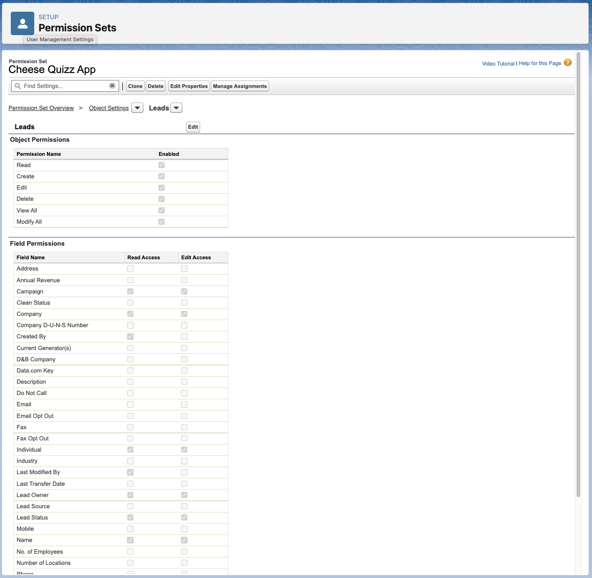

  Also update the `App Permissions` and be sure to include the *Convert Leads* permissions within the Sales category:

  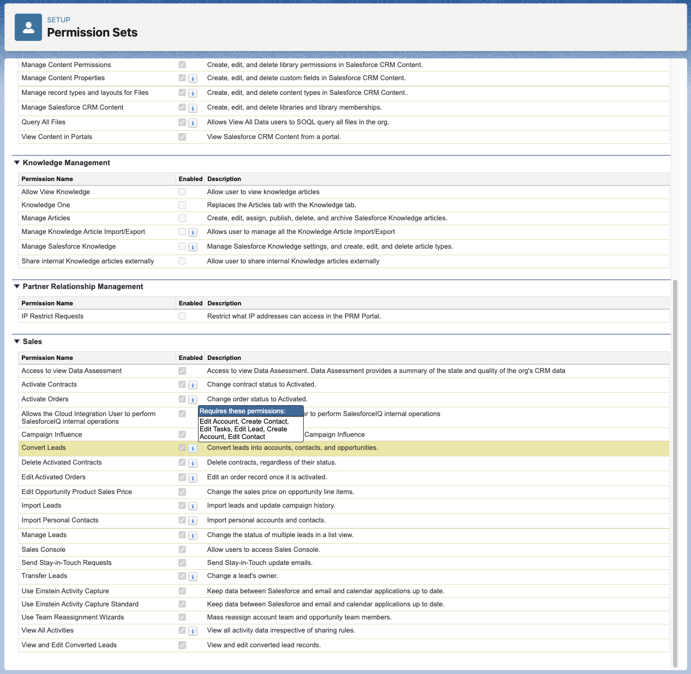

  Finally, associate this new permission set to your connected application:

  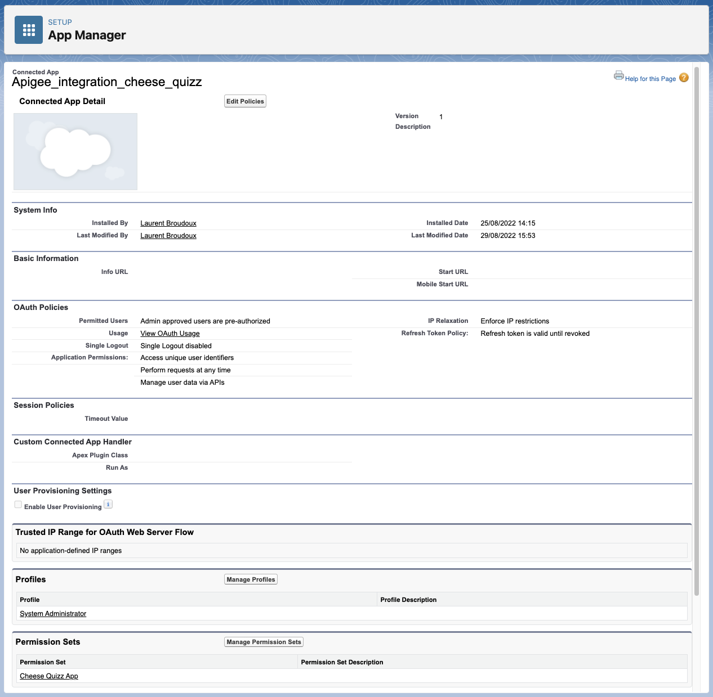
</details>

In our integration designer, letr start by creating a new integration called `cheese-quizz-like-to-salesforce`.

To start, drop a new Cloud Pub/Sub trigger from the paletter. You'll have to configure it to connect to our previously created topic at `projects/cheese-quizz/topics/cheese-quizz-likes`.

Just after that you'll have to add the Salesforce connector, picking the Entities *action* and choosing to create the *Lead* data type:

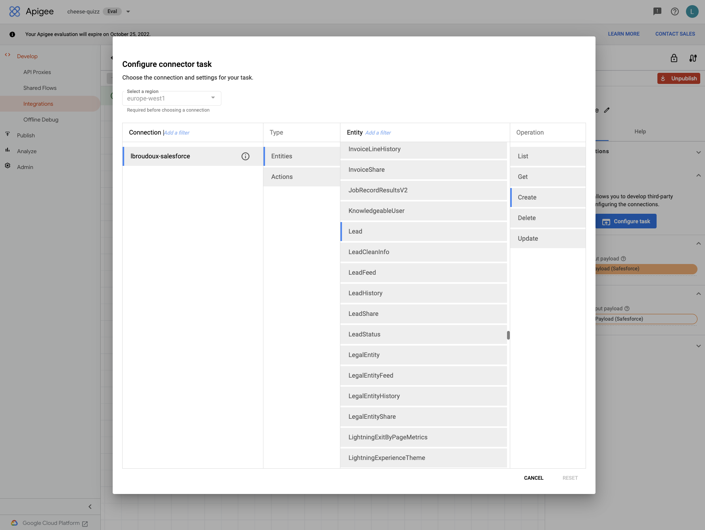

Finally, in the next screen, you'll have to add a `Data Mapping` intermediary step to allow transformation of the PubSub message data.

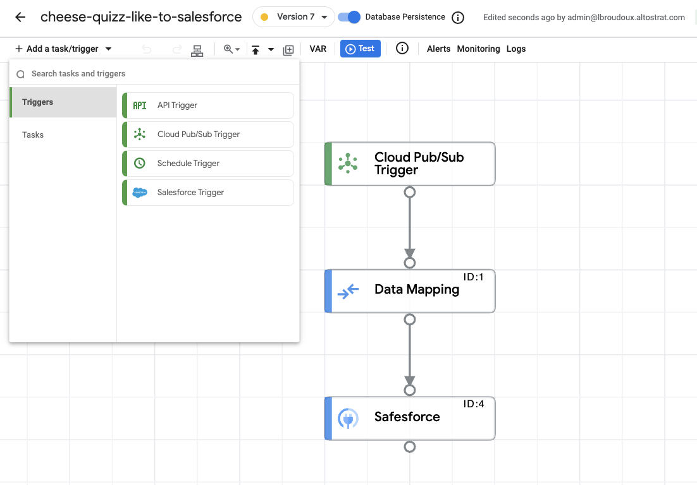

In this `Data Mapping` step, we're going to start by transforming the incoming Pub/Sub message into a new variable called `cheeseLike`. You'll have to declare this new variable on the left. You can initialize its type representation with the following example paylod:

```json
{
  "email": "john.doe@gmail.com",
  "username": "John Doe",
  "cheese": "Cheddar"
}
```

We'll then realize a mapping between following fields:

* `username` will be split into FirstName and LastName,
* `email` will remain `Email`,
* `cheese` will fedd the `Description` field

We'll add two extras constants on the left hand pane:

* `Quizz Player` will feed the `Company` field that is required on the Salesforce side,
* `cheese-quizz-app` will feed the `LeadSource`field.

You should have something like this:

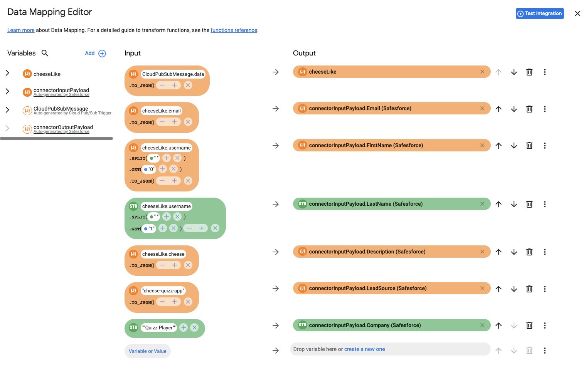

Our integration is now ready but before deploying it, we have to give the correct persmissions to the Apigee service account that will run the integration flow. Just execute these commands:


```sh
export PROJECT=cheese-quizz
export PROJECT_NUMBER=$(gcloud projects describe cheese-quizz --format 'value(projectNumber)') 

gcloud projects add-iam-policy-binding $PROJECT \
    --member=service-$PROJECT_NUMBER@gcp-sa-apigee.iam.gserviceaccount.com \
    --role=roles/pubsub.subscriber
    
gcloud projects add-iam-policy-binding $PROJECT \
    --member=service-$PROJECT_NUMBER@gcp-sa-apigee.iam.gserviceaccount.com \
    --role=roles/integrations.apigeeIntegrationAdminRole
```

Hit the **Publish** button and wait a minute or two that Apigee built and publish the integration component. Once OK your should be able to fill out the connoisseur form on the app side and hit the **Like button**. Just see Cloud Function popping out for processing the HTTP call and producing a message into the Pub/Sub broker. Then the Apigee integration route will take care of transformaing this message into a Salesforce *Lead*.

The result should be something like this on the Salesforce side:

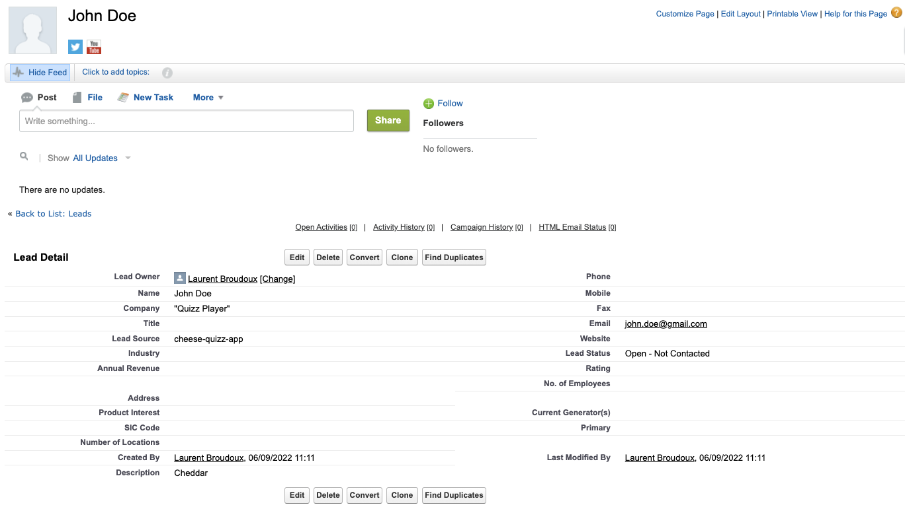

You can track activity of the integration route, looking at the *Logs* tab in the route details:

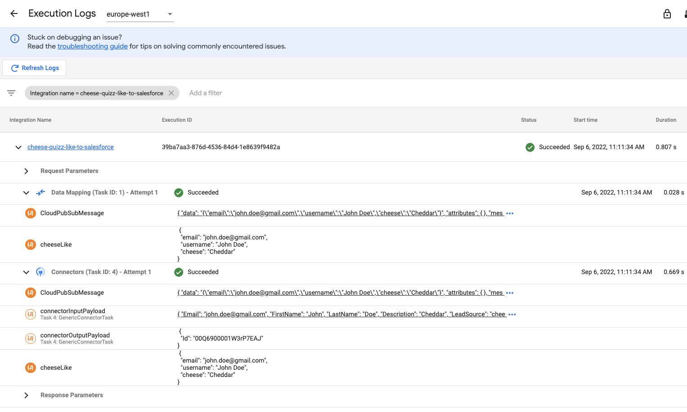