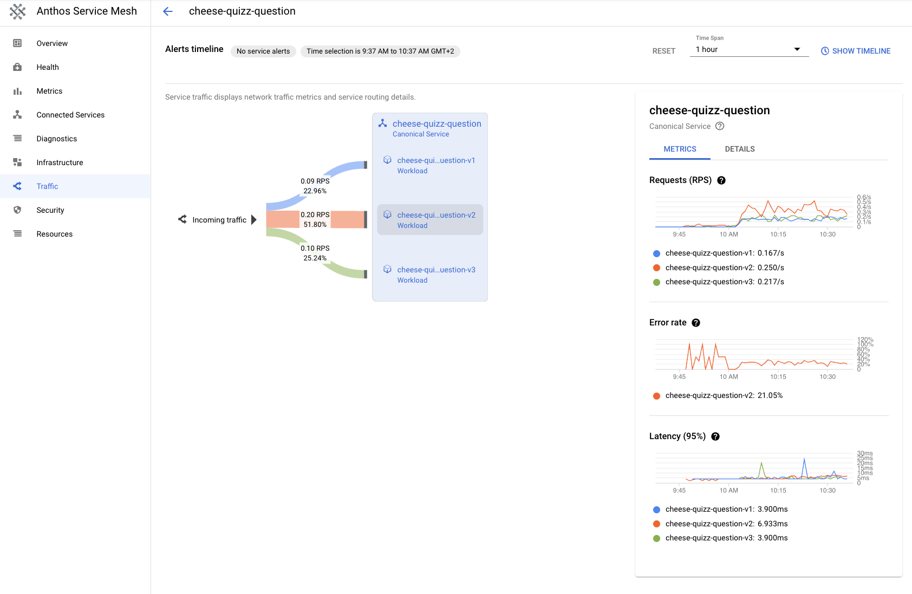
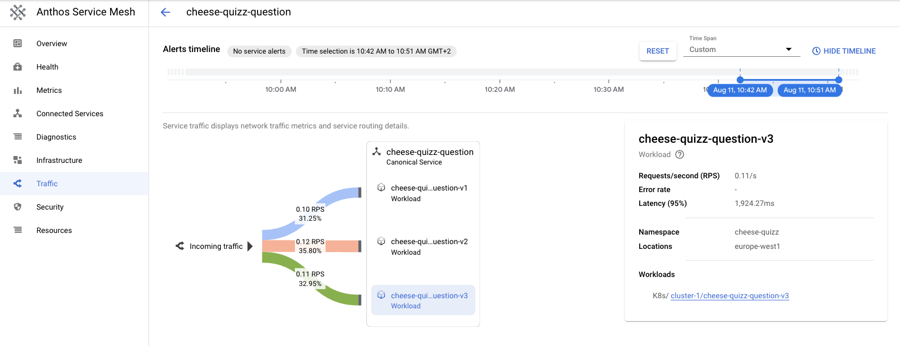
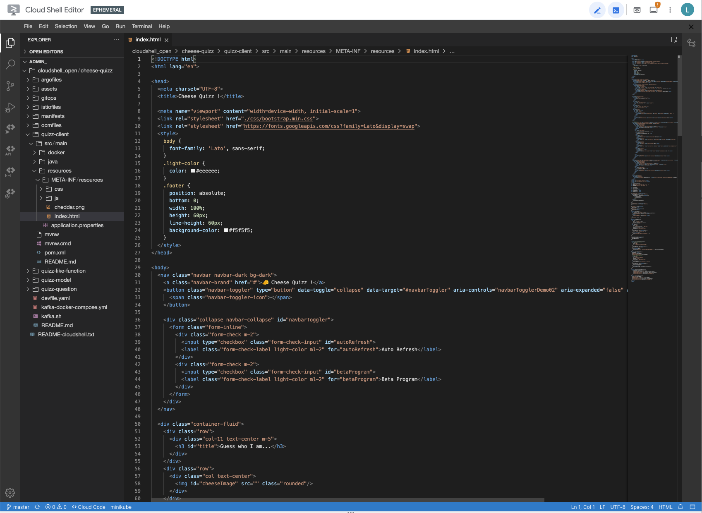
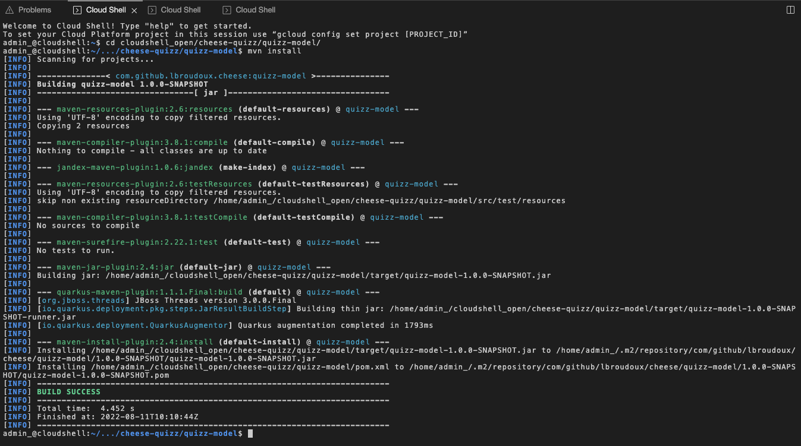

# cheese-quizz


A fun cheese quizz deployed on GKE and illustrating cloud native technologies like Quarkus, Anthos Service Mesh, Cloud Code, Cloud Build, Cloud Function, Google PubSub, Apigee Integration and ....

> This is a port to Google platform of this original [cheese-quizz](https://github.com/lbroudoux/cheese-quizz). This is a *Work In Progress*.

* **Part 1** Try to guess the displayed cheese! Introducing new cheese questions with Canaray Release and making everything resilient and observable using Istio Service Mesh. Deploy supersonic components made in Quarkus,

* **Part 2** Implement a new "Like Cheese" feature in a breeze using Google Cloud Code, demonstrate the inner loop development experience and then deploy everything using Cloud Build.

* **Part 3** Add the "Like Cheese API" using Serverless Cloud Function and make it push new messages to PubSub broker. Use Apigee Integration IPaaS to deploy new integration services and create lead into Salesforce CRM ;-) 


## Project Setup

```sh
gcloud services enable cloudbuild.googleapis.com servicenetworking.googleapis.com
```

## Cluster Setup

Check that Workload identity is enabled:

```sh
$ gcloud container clusters describe cluster-1 --format="value(workloadIdentityConfig.workloadPool)" --region europe-west1
```

If result is `cheese-quizz.svc.id.goog` then it's enabled.


Reference: https://cloud.google.com/service-mesh/docs/managed/auto-control-plane-with-fleet

```sh
$ gcloud container fleet memberships list 
NAME       EXTERNAL_ID
cluster-1  b43cd750-de46-4e43-b98e-2834aa1e4ad4
```

```sh
$ gcloud container fleet memberships describe cluster-1
authority:
  identityProvider: https://container.googleapis.com/v1/projects/cheese-quizz/locations/europe-west1/clusters/cluster-1
  issuer: https://container.googleapis.com/v1/projects/cheese-quizz/locations/europe-west1/clusters/cluster-1
  workloadIdentityPool: cheese-quizz.svc.id.goog
createTime: '2022-08-09T16:39:21.930439260Z'
description: cluster-1
endpoint:
  gkeCluster:
    resourceLink: //container.googleapis.com/projects/cheese-quizz/locations/europe-west1/clusters/cluster-1
  kubernetesMetadata:
    kubernetesApiServerVersion: v1.22.10-gke.600
    memoryMb: 12369
    nodeCount: 3
    nodeProviderId: gce
    updateTime: '2022-08-09T17:05:08.118548452Z'
    vcpuCount: 6
externalId: b43cd750-de46-4e43-b98e-2834aa1e4ad4
name: projects/cheese-quizz/locations/global/memberships/cluster-1
state:
  code: READY
uniqueId: 295d5c06-65ce-44dd-8922-8626b7fe6af5
updateTime: '2022-08-09T17:05:08.263985853Z'
```

```sh
$ gcloud container fleet mesh describe --project cheese-quizz
createTime: '2022-06-27T16:48:51.055892224Z'
membershipStates:
  projects/966285747060/locations/global/memberships/cluster-1:
    servicemesh:
      controlPlaneManagement:
        state: DISABLED
    state:
      code: OK
      description: Please see https://cloud.google.com/service-mesh/docs/install for
        instructions to onboard to Anthos Service Mesh.
      updateTime: '2022-08-09T17:06:37.217361639Z'
name: projects/cheese-quizz/locations/global/features/servicemesh
resourceState:
  state: ACTIVE
spec: {}
updateTime: '2022-08-09T17:06:40.106900964Z'
```

```sh
gcloud container fleet mesh update \
     --control-plane automatic \
     --memberships cluster-1 \
     --project cheese-quizz
```

```sh
$ gcloud container fleet mesh describe --project cheese-quizz
createTime: '2022-06-27T16:48:51.055892224Z'
membershipSpecs:
  projects/966285747060/locations/global/memberships/cluster-1:
    mesh:
      controlPlane: AUTOMATIC
membershipStates:
  projects/966285747060/locations/global/memberships/cluster-1:
    servicemesh:
      controlPlaneManagement: {}
    state:
      code: OK
      description: Please see https://cloud.google.com/service-mesh/docs/install for
        instructions to onboard to Anthos Service Mesh.
      updateTime: '2022-08-09T17:09:08.560029461Z'
name: projects/cheese-quizz/locations/global/features/servicemesh
resourceState:
  state: ACTIVE
spec: {}
state:
  state: {}
updateTime: '2022-08-09T17:09:09.793769752Z'
```

After some time: 

```sh
$ kubectl -n istio-system get controlplanerevision
NAME          RECONCILED   STALLED   AGE
asm-managed   True         False     4m15s
```

Reference: https://cloud.google.com/service-mesh/docs/anthos-service-mesh-proxy-injection

```sh
$ kubectl label namespace cheese-quizz istio-injection- istio.io/rev=asm-managed --overwrite
label "istio-injection" not found.
namespace/cheese-quizz labeled
```

Enabled Tracing as specified in https://cloud.google.com/service-mesh/docs/managed/enable-managed-anthos-service-mesh-optional-features#enable_cloud_tracing. Raise the `sampling` rate so that we'll be able to see changes faster. Here's the extract of `istio-asm-managed` config map:

```yaml
data:
  mesh: |-
    defaultConfig:
      tracing:
        sampling: 50
        stackdriver: {}
```


## Demo setup

We need to setup the following resources for our demonstration:

* A `cheese-quizz` namespace for holding your project component

```sh
kubectl apply -f manifests/quizz-question-deployment-v1.yml -n cheese-quizz
kubectl apply -f manifests/quizz-question-deployment-v2.yml -n cheese-quizz
kubectl apply -f manifests/quizz-question-deployment-v3.yml -n cheese-quizz
kubectl apply -f manifests/quizz-question-service.yml -n cheese-quizz
kubectl apply -f manifests/quizz-question-destinationrule.yml -n cheese-quizz
kubectl apply -f manifests/quizz-question-virtualservice-v1.yml -n cheese-quizz
```


```sh
gcloud builds submit --config quizz-client/cloudbuild.yaml quizz-client/
```

```sh
kubectl apply -f manifests/quizz-client-deployment.yml -n cheese-quizz
kubectl apply -f manifests/quizz-client-service.yml -n cheese-quizz
```

```sh
gcloud compute addresses create cheese-quizz-gke-adr --global
kubectl apply -f manifests/quizz-client-ingress.yml -n cheese-quizz
```

## Demonstration scenario

Once above commands are issued and everything successfully deployed, retrieve the Cheese Quizz route:

```sh
$ kubectl get ingress/cheese-quizz-client-ingress -n cheese-quizz | grep cheese-quizz-client | awk '{print $3}'
```

and open it into a browser. You should get the following:


### Anthos Service Mesh demonstration

#### Canary release and blue-green deployment

Introduce new `v2` question using Canary Release and header-matching routing rules:

```
kubectl apply -f istiofiles/vs-cheese-quizz-question-v1-v2-canary.yml -n cheese-quizz
```

Using the hamburger menu on the GUI, you should be able to subscribe the `Beta Program` and see the new Emmental question appear ;-) 


Now turning on the `Auto Refresh` feature, you should be able to visualize everything into Kiali, showing how turning on and off the Beta subscription has influence on the visualization of networks routes.

Once we're confident with the `v2` Emmental question, we can turn on Blue-Green deployment process using weighted routes on the Istio `VirtualService`. We apply a 70-30 repartition:

```
kubectl apply -f istiofiles/vs-cheese-quizz-question-v1-70-v2-30.yml -n cheese-quizz
```

Of course we can repeat the same kind of process and finally introduce our `v3` Camembert question into the game. Finally, we may choose to route evenly to all the different quizz questions, applying a even load-balancer rules on the `VirtualService`: 

```
kubectl apply -f istiofiles/vs-cheese-quizz-question-all.yml -n cheese-quizz
```

#### Circuit breaker and observability

Now let's check some network resiliency features of OpenShift Service Mesh.

Start by simulating some issues on the `v2` deployed Pod. For that, we can remote log to shell and invoke an embedded endpoint that will make the pod fail. Here is bellow the sequence of commands you'll need to adapt and run:

```sh
$ kubectl get pods -n cheese-quizz | grep v2
cheese-quizz-question-v2-5c96c7dc46-bmw2q   2/2     Running   0          14m0          5d19h

$ kubectl exec -it cheese-quizz-question-v2-5c96c7dc46-bmw2q -n cheese-quizz -- /bin/bash
----------- TERMINAL MODE: --------------------
[root@cheese-quizz-question-v2-5c96c7dc46-bmw2q work]# curl localhost:8080/api/cheese/flag/misbehave
Following requests to / will return a 503
[root@cheese-quizz-question-v2-5c96c7dc46-bmw2q work]# exit
exit
```

Back to the browser window you should now have a little mouse displayed when application tries to reach the `v2` question of the quizz.


Using obervability features that comes with Anthos Service Mesh like Traffic Monitoring and Tracing, you are now able to troubleshoot and check where the problem comes from (imagine that we already forgot we did introduce the error ;-))

Thus you can see the Pod causing troubles with traffic monitoring graph:


> You may notice that traffic is not evenly dsitributed among the 3 versions since we introduce therror. You'll understand that in a minute.

And inspect traces that are available from the Service Metrics pane to see errors. Be sure to add a `LABEL:error : true` criterion to the search bar:


In order to make our application more resilient, we have to start by creating new replicas, so scale the `v2` deployment.

```
kubectl scale deployment/cheese-quizz-question-v2 --replicas=2 -n cheese-quizz
```

Newly created pod will serve requests without error but we can see in the Kiali console that the service `cheese-quizz-question` remains degraded (despite green arrows joinining `v2` Pods).



There's still some errors in distributed traces. You can inspect what's going on using Traces and may check that there's still some invocations going to the faulty `v2` pod.


Istio proxies automatically retry doing the invocation to `v2` because a number of conditions are present:
* There's a second replica present,
* It's a HTTP `GET` request that is supposed to be idempotent (so replay is safe).

An optimal way of managing this kind of issue would be to declare a `CircuitBreaker` for handling this problem more efficiently. Circuit breaker policy will be in charge to detect Pod return ing errors and evict them from the elligible targets pool for a configured time. Then, the endpoint will be re-tried and will re-join the pool if everything is back to normal.

Let's apply the circuit breaker configuration to our question `DestinationRule`:

```
kubectl apply -f istiofiles/dr-cheese-quizz-question-cb.yml -n cheese-quizz
```

Checking the traces once again in Tracing, you should no longer see any errors! 

#### Timeout/retries management

Pursuing with network resiliency features of OpenShift Service Mesh, let's check now how to handle timeouts.

Start by simulating some latencies on the `v3` deployed Pod. For that, we can remote log to shell and invoke an embedded endpoint that will make the pod slow. Here is bellow the sequence of commands you'll need to adapt and run:

````sh
$ kubectl get pods -n cheese-quizz | grep v3
cheese-quizz-question-v3-8c5448d46-6nn7c    2/2     Running   0          147m

$ kubectl exec -it cheese-quizz-question-v3-8c5448d46-6nn7c -n cheese-quizz -- /bin/bash
----------- TERMINAL MODE: --------------------
[root@cheese-quizz-question-v3-8c5448d46-6nn7c work]# curl localhost:8080/api/cheese/flag/timeout
Following requests to / will wait 3s
[root@cheese-quizz-question-v3-8c5448d46-6nn7c work]# exit
exit
````

Back to the browser window you should now have some moistures displayed when application tries to reach the `v3` question of the quizz.


Before digging and solving this issue, let's review the application configuration :
* A 3 seconds timeout is configured within the Pod handling the `v3` question. Let see the [question source code](https://github.com/lbroudoux/cheese-quizz/blob/master/quizz-question/src/main/java/com/github/lbroudoux/cheese/CheeseResource.java#L110)
* A 1.5 seconds timeout is configured within the Pod handling the client. Let see the [client configuration](https://github.com/lbroudoux/cheese-quizz/blob/master/quizz-client/src/main/resources/application.properties#L14)

Checking the distributed traces within Kiali console we can actually see that the request takes 1.5 seconds before returning an error:


In order to make our application more resilient, we have to start by creating new replicas, so scale the `v3` deployment.

```
kubectl scale deployment/cheese-quizz-question-v3 --replicas=2 -n cheese-quizz
```

Newly created pod will serve requests without timeout but we can see in the Traffic console that the service `cheese-quizz-question` remains degraded (see increased latency on `v3` Pods).



However there's still some errors in distributed traces. You can inspect what's going on using Tracing and may check that there's still some invocations going to the slow `v3` pod.

The `CircuitBreaker` policy applied previsouly does not do anything here because the issue is not an application problem that can be detected by Istio proxy. The result of a timed out invocation remains uncertain, but we know that in our case - an idempotent `GET` HTTP request - we can retry the invocation.

Let's apply for this a new `VirtualService` policy that will involve a retry on timeout.

```
kubectl apply -f istiofiles/vs-cheese-quizz-question-all-retry-timeout.yml -n cheese-quizz
```

Once applied, you should not see errors on the GUI anymore. When digging deep dive into the distributed traces offered by OpenShift Service Mesh, you may however see errors traces. Getting into the details, you see that detailed parameters of the `VirtualService` are applied: Istio do not wait longer than 100 ms before making another attempt and finally reaching a valid endpoint.


The Service Mesh traffic graph allows to check that - from a end user point of view - the service is available and green. We can see that time-to-time the HTTP throughput on `v3` may be reduced due to some failing attempts but we have now great SLA even if we've got one `v2` Pod failing and one `v3` Pod having response time issues:


#### Direct access through a Gateway

### Cloud Code demonstration

This is the beginning of **Part 2** of the demonstration. Start modifying our application by opening the code in Cloud Shell Editor with below button:

<a target="__blank" href="https://shell.cloud.google.com?git_repo=https://github.com/lbroudoux/cheese-quizz&page=editor"></a>

> If it's the first time, you're connecting the service, you'll need to authenticate and approve the reuse of your profile information.

After some minutes, the workspace is initialized with the source files coming from a Git clone. You can spend time exploring the content of the wokspace.



Now let's build and deploy some components in order to illustrate the development inner loop.

Launch a new ternminal (`Terminal > New Terminal`), navigate to the `quizz-model` component and install it using the `mvn install` command. Here's rge terminal results below:



Then, you will be able to launch the `quizz-question` module in Quarkus development mode through terminal. Navigate to correct module and issue the `mvn quarlus:dev` command.


Finally, you can launch the `quizz-client` module using a new terminal window this time. Navigate to correct module and issue the `mvn quarlus:dev` command as shown below. 


Now you will have access to the GUI, running in Cloud Shell Editor, by launching the preview and configuring it on port `8081`:


It's time to talk a little bit about Quarkus, demo hot reloading and explain how we're gonna implement the "Like Cheese" screen by modifying `src/main/resources/META-INF/index.html` and test it locally:


Before commiting our work, we'd like to talk a bit about how to transition to the outer-loop and trigger deployment pipeline.

### Cloud Build Pipelines demonstration

https://cloud.google.com/architecture/accessing-private-gke-clusters-with-cloud-build-private-pools#creating_a_private_pool
https://g3doc.corp.google.com/company/gfw/support/cloud/playbooks/cloud-build/private-pools.md?cl=head#static-external-ip-address

```sh
PROJECT_NUMBER=$(gcloud projects describe cheese-quizz --format 'value(projectNumber)') 

# Must create a dedicated vpc to be peered with Cloud Build private pool.
gcloud compute networks create cloud-build-pool-vpc --subnet-mode=CUSTOM

# With only one subnet on our region.
gcloud compute networks subnets create cloud-build-pool-network \
  --range=10.124.0.0/20 --network=default --region=europe-west1

# Now create a router to control how we access internet from this vpc
gcloud compute routers create cloud-build-router \
  --network=cloud-build-pool-vpc \
  --region=europe-west1

# Reserve a static IP address for egress. This IP must be added in authorized CIDR for the GKE cluster API access.
gcloud compute addresses create cloud-build-egress-ip --region=europe-west1

# Configure NAT Gateway to use this egress IP.
gcloud compute routers nats create cloud-router-nat-gateway \
  --router=cloud-build-router \
  --region=europe-west1 \
  --nat-custom-subnet-ip-ranges=cloud-build-pool-network  \
  --nat-external-ip-pool=cloud-build-egress-ip

# Now create a simple VM to act as a proxy/nat for outgoing traffic.
gcloud compute instances create cloud-build-proxy-nat --zone=europe-west1-b \
  --machine-type=n1-standard-1 --image-project=ubuntu-os-cloud --image-family=ubuntu-1804-lts \
  --network=cloud-build-pool-vpc --subnet=cloud-build-pool-subnet --private-network-ip 10.124.0.5 --no-address \
  --tags allowlisted-access --can-ip-forward \
  --metadata=startup-script=$'sysctl -w net.ipv4.ip_forward=1 && iptables -t nat -A POSTROUTING -o $(/sbin/ifconfig | head -1 | awk -F: {\'print $1\'}) -j MASQUERADE'

# Reconfigure access to internet forcing non tagged traffic to go to the VM first.
gcloud compute routes create nat-route-to-internet \
  --destination-range=0.0.0.0/1 --next-hop-address=10.124.0.5 --network=cloud-build-pool-vpc 

gcloud compute routes create nat-route-to-internet-2 \
  --destination-range=128.0.0.0/1 --next-hop-address=10.124.0.5 --network=cloud-build-pool-vpc 

gcloud compute routes create nat-route-to-internet-tagged \
  --destination-range=0.0.0.0/1 --next-hop-gateway=default-internet-gateway --network=cloud-build-pool-vpc \
  --priority 10 --tags allowlisted-access

gcloud compute routes create nat-route-to-internet-tagged-2 \
  --destination-range=128.0.0.0/1 --next-hop-gateway=default-internet-gateway --network=cloud-build-pool-vpc \
  --priority 10 --tags allowlisted-access

# In the VPC network, allocate a named IP range for vpc peeering.
gcloud compute addresses create cloud-build-pool-range \
    --global \
    --purpose=VPC_PEERING \
    --addresses=192.168.0.0 \
    --prefix-length=20 \
    --network=cloud-build-pool-vpc \
    --project=cheese-quizz

# Create a private connection between the service producer network and your VPC network
gcloud services vpc-peerings connect \
    --service=servicenetworking.googleapis.com \
    --ranges=cloud-build-pool-range \
    --network=cloud-build-pool-vpc \
    --project=cheese-quizz

# Custom routes to the internet (through the VM) should be exported on the peered managed VPC.
gcloud compute networks peerings update servicenetworking-googleapis-com \
    --network=cloud-build-pool-vpc \
    --export-custom-routes \
    --no-export-subnet-routes-with-public-ip

# Create the Cloud Build worker pool that is peered to default network
gcloud builds worker-pools create my-pool \
    --project=cheese-quizz \
    --region=europe-west1 \
    --peered-network=projects/cheese-quizz/global/networks/cloud-build-pool-vpc \
    --worker-machine-type=e2-standard-2 \
    --worker-disk-size=100GB
    
# Create the Cloud Build workker pool that is peered to default network
gcloud builds worker-pools create my-pool \
    --project=cheese-quizz \
    --region=europe-west1 \
    --peered-network=projects/cheese-quizz/global/networks/cloud-build-pool-vpc \
    --worker-machine-type=e2-standard-2 \
    --worker-disk-size=100GB

# Now create the build trigger (finally!)
gcloud beta builds triggers create github \
    --name=quizz-client-trigger \
    --repo-name=cheese-quizz-gke \
    --repo-owner=lbroudoux \
    --branch-pattern=main \
    --included-files=quizz-client/** \
    --build-config=quizz-client/cloudbuild-pipeline.yaml
```


```sh
gcloud functions deploy cheese-quizz-like-function \
    --gen2 --region=europe-west1 \
    --runtime=nodejs16 \
    --source=quizz-like-function-cf \
    --entry-point=apiLike \
    --trigger-http --allow-unauthenticated \
    --service-account cheese-like-function-sa@cheese-quizz.iam.gserviceaccount.com
```

```
curl -XPOST https://cheese-quizz-like-function-66y2tgl4qa-ew.a.run.app -k -H 'Content-type: application/json' -d '{"greeting":"hello4"}'
```


### Apigee Integration

```sh
gcloud services enable apigee.googleapis.com \
  servicenetworking.googleapis.com compute.googleapis.com \
  cloudkms.googleapis.com --project=cheese-quizz

gcloud compute addresses create google-managed-services-default \
  --global \
  --prefix-length=22 \
  --description="Peering range for Google Managed services" \
  --network=default \
  --purpose=VPC_PEERING \
  --project=cheese-quizz

gcloud compute addresses create google-managed-services-support-1 \
  --global \
  --prefix-length=28 \
  --description="Peering range for supporting Apigee services" \
  --network=default \
  --purpose=VPC_PEERING \
  --project=cheese-quizz

gcloud services vpc-peerings connect \
  --service=servicenetworking.googleapis.com \
  --network=default \
  --ranges=google-managed-services-default \
  --project=cheese-quizz

# If previous command is not ok, try update with force ;-)
gcloud services vpc-peerings update \
  --service=servicenetworking.googleapis.com \
  --network=default \
  --ranges=google-managed-services-default \
  --project=cheese-quizz

# Or replace with with double peering to enabled 
gcloud services vpc-peerings connect \
  --service=servicenetworking.googleapis.com \
  --network=default \
  --ranges=google-managed-services-default,google-managed-services-support-1 \
  --project=cheese-quizz

gcloud alpha apigee organizations provision \
  --runtime-location=europe-west1 \
  --analytics-region=europe-west1 \
  --authorized-network=default \
  --project=cheese-quizz
```

```sh
$ openssl req -x509 -sha256 -nodes -days 36500 -newkey rsa:2048 -keyout salesforce.key -out salesforce.crt
Generating a 2048 bit RSA private key
..............................................................+++
.................................+++
writing new private key to 'salesforce.key'
-----
You are about to be asked to enter information that will be incorporated
into your certificate request.
What you are about to enter is what is called a Distinguished Name or a DN.
There are quite a few fields but you can leave some blank
For some fields there will be a default value,
If you enter '.', the field will be left blank.
-----
Country Name (2 letter code) []:FR
State or Province Name (full name) []:Sarthe
Locality Name (eg, city) []:Le Mans
Organization Name (eg, company) []:lbroudoux
Organizational Unit Name (eg, section) []:Home
Common Name (eg, fully qualified host name) []:localhost
Email Address []:laurent.broudoux@gmail.com
```